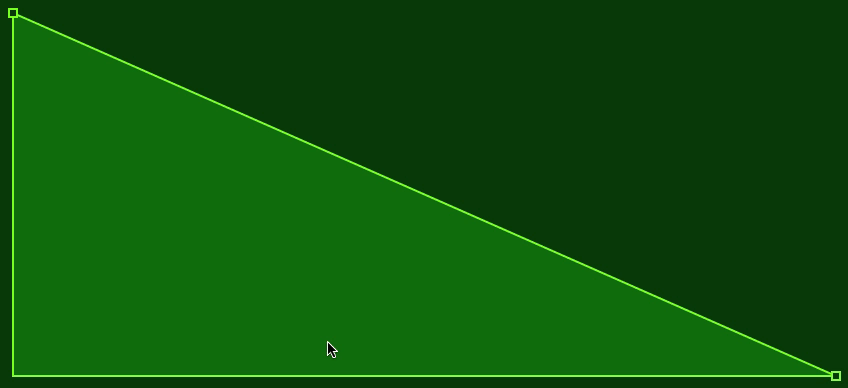

# MMMSEGUI



MMMSEGUI is a multi-segment graph editor written in JS/JSUI/MGraphics for Cycling 74's Max platform.
## Rationale

The main objectives for MMMSEGUI were:

* have the ability to output directly into a list message for use with the `curve~` Max object
* make it very simple and fast to use while minimising modifier key requirement
* have the ability to add and delete nodes quickly and intuitively
* have the ability to easily alter curve shapes and move graph segments around
* have it easy to add to other projects and save the settings with your patchers
* have it be very customisable

In addition to this, recent updates include:

* automatic resizing of the graph when resizing the JSUI window
* commands to clear the graph and also to create a graph through a message list
* poll the graph to sample single values at a given point in the time (X) axis
* the ability to set the X, Y and control point of a single node via messages

For any previous users please read the following section regarding the November 2023 update.
## Support My Work

If you like my work and use it or learn from it, please consider supporting me or just a donation to say thanks:

<a href="https://www.buymeacoffee.com/neilbaldwi3" target="_blank"></a>

## Important - Major Update and Refactoring November 2023

A soft apology to any existing users, especially if you've incorporated MMMSEGUI into any of your own projects and patchers. This update has **MAJOR** changes:

* any parameters you were setting with messages previously will likely break as I've renamed several functions and standardised things a bit.

* when you load a patcher that used the old version of MMMSEGUI, using the new JS file will likely not apply customisations properly. You may need to "relink" the JSUI object to the new `mmmsegui.js` file. You'll also need to immediately save your patcher and reload it to make sure your patcher is saving parameters with the correct internal parameter names.

It was difficult to incorporate many of the changes without some collateral damage. I hope it's not too painful for you and have faith that the ground-up refactoring has improved the overall structure so this situation won't happen in future. Shouldn't happen. Never say never in development!
#### 18/11/2023 Update Overview

The entire documentation has been updated but here are the highlights:

* setting up and instantiating is now WAY simpler. Sensible default values are generated rather than making the user define them.
* changed mouse behaviour adding and removing nodes: now just double-click instead of SHIFT + click
* the curve shape of a segment can be reset (to linear) by holding SHIFT and double-clicking the segment
* MMMSEGUI will now resize itself if you resize the JSUI window
* the `@parameter` method of setting customisation has been removed in favour of dedicated messages
* there is now a much simpler `fillcolor`, `strokeColor`, and `bgColor` to set the graph colors along with a set of new messages for customising other features (see below)
* there is `clear` command to reset the graph (customisations are persistent)
* added a `graph` command to define a graph numerically for making templates and presets etc.
* similarly there is a `graphfromcurve` command that lets you define a graph numerically using MMMSEGUI output format (input format for Max `[curve~]`) 
* you can now move a graph segment in both the X and Y axis (hold SHIFT and drag the curve segment), previously you could only move a segment in the  Y axis.
* two new commands to sample the graph Y value at a point in time, `getvalue` uses a normalised value as the X position where `getvalueattime` lets you specify a time in ms.
* some new commands to modify position and control point parameters for individual nodes
## Content and Installation

* `mmmsegui.js` is the main JSUI file you need to use MMMSEGUI.
* `mmmsegui.maxpat` is the demo patcher to demonstrate MMMSEGUI features
* `readme.md` this file.
* `mmmseg_audio_demo_1.maxpat` demo of MMMSEGUI using a very basic step sequencer that drive a monophonic synth voice. Two step sequencers control pitch and LPF cutoff. Three MMMSEGUI envelopes control pitch, low-pass filter and overdrive modulation.
* `mmmseg_audio_demo_2.maxpat` a simple 4-step sequencer steps through four MMSEGUIs, each of which modulate the pitch of a `[rect~]` oscillator. You can change the metro tempo and also whether the MMSEGUIs loop (the `curve~` objects are re-triggered when they reach their end point).
## Adding MMMSEGUI To Your Patcher

Put the `mmmsegui.js` file in your Max search path(s) then add a JSUI object to your patcher specifying the MMMSEGUI filename:

```javascript
[JSUI @filename mmmsegui.js]
```

The default MMMSEGUI only contains two nodes, the end and start nodes. These cannot be deleted and only their Y position (and curve shape) can be changed. To add more nodes (or delete them) you need to use the mouse (and keyboard).
## Adding, Deleting and Moving Nodes.  And Curves.

| Function | Mouse Control |
|---|---|
| Add a new node | Double-click on a curve segment. The new node will be placed where you click. |
| Delete a node | Double-click an existing node. |
| Move a node | Click and drag a node with the mouse. |
| Change curve shape | Click and drag a curve segment with the mouse. 
| Move a curve segment | Hold `SHIFT` then click and drag a curve segment with the mouse. |
| Reset curve shape for a segment | Hold `SHIFT` then double-click a curve segment.|

> **Deleting Nodes**
> You cannot delete the first and last nodes. They have a square shape to distinguish them from regular nodes (circular).

> **Moving Curve Segments**
> Movement will be constrained in the Y axis by whichever of the two defining nodes is the highest/lowest. Movement will be constrained in the X axis by the X position of the previous and next node in the graph.
## Customisation Messages

Customisation is done via Max message objects. For data type see the **Notes** column. Some error/range checking/clamping is done but I'm sure you can break it if you try.

| Message | Description | Notes |
|---|---|---|
| `fillcolor` | Sets the fill color for the graph. | RGBA (floats) |
| `strokeColor` | Sets the stroke color for the graph. | RGBA (floats) |
| `bgColor` | Sets the background color underneath the graph. | RGBA (floats) |
| `nodesize` | Sets the radius of the nodes in pixels. | Value clamped 2.5 to 8|
| `linewidth` | Sets the line width (graph and node stroke) | Value clamped 1.0 to 4.0 |
| `padding` | Sets a padding amount inside the JSUI window in pixels. | Clamped 0 to 32 |
| `timescale` | Sets the scale of the X axis output in MS | Default 1000ms |
| `autooutput` | Determines if graph values are constantly output or only when banged. | 0/1, default: 1 |
| `nodehighlighting` | Highlight node when mouse over. | 0/1, default : 1 |
| `curvehighlighting` | Highlight curve when mouse over. | 0/1, default : 1|
| `autohidenodes` | Automatically hide nodes when mouse not in JSUI window | 0/1, default : 1 |
| `nodesvisible` | Override to make nodes always visible (or not!) | 0/1, default : 0 |
| `mousespeed` | Mouse movement scaling when dragging nodes and curves | Default 1.0 |

#### Color Messages
For the color messages that have the RGBA data type there are 4 values, so your message will look like: `[fillcolor $1 $2 $3 $4]` where $1 is the red value, $2 is the green value, $3 is the blue value and $4 is the alpha value. This is standard RGBA format in Max and is the output from `[colorpicker @compatibility 0]` or `[swatch]` etc.
#### Auto Output
Auto Output is on by default (turn it off with `[autooutput 0]`)which means anything you do that changes the nodes, curves or timescale will cause MMMSEGUI to output the current graph as a `curve~` formatted list. If you set Auto Output to off, nothing will be output from MMMSEGUI until you send a `bang` message to its inlet. The only exception to this is the `getvalue` and `getvalueattime` commands (see Command Messages), for obvious reasons. Sending messages to MMMSEGUI that only change the graphical *look* of the graph will not cause output of node list.
## Command Messages

In addition to customisation there are some messages that control MMMSEGUI:

| Message | Description |
|---|---|
| `clear` | Resets the graph to default two-node shape. Customisations will remain intact. |
| `graph` | You send send a list of values to MMMSEGUI to create a graph numerically. |
| `graphfromcurve` |  Similar to `graph` but you can paste the output from MMMSEGUI to define the graph |
| `getvalue n` | Get the Y value at the specified position `n` (normalised X position) |
| `getvalueattime n` | Get the Y value at the specified time `n` (ms) |
| `setxat n x` | Set the X position `x` for the node `n` |
| `setyat n y` | Set the Y position `y` for the node `n` |
| `setcat n c` | Set the control point `c` for the node `n` |
| `setnode n x y c` | Set the position and control point for node `n` |
### Set Value Commands

A new set of commands to enable you to set the position and curve shape of individual nodes in your graph. This has some  interesting uses especially using an external signal to modulate node coordinates.

`setxat n x`, `setyat n, y` and `setcat n c` are used to set the X, Y and control point of node `n`

`setnode n x y c` allows you to set all the properties of a node in a single command.

Node number `n` needs to be a valid node in the current graph but MMMSEGUI will just reject the command silently if the node number is invalid.

The X position is constrained by the X position of the previous and next node in the graph.

You cannot change the X position of the first and last node. The first node is node 0.

Setting the curve point, `c`, affects the shape of the curve *to the right* of the specified node `n`.

### Get Value Commands

Another two new commands, `getvalue` and `getvalueattime` allow you to sample the graph with a position/time input and get the normalised Y value at that point.

The value is output from `[outlet 2]`, 0.0 to 1.0 with 0.0 being at the bottom and 1.0 at the top.

`getvalue` input is clamped to 0.0 - 1.0 whereas `getvalueattime` will post an error to the Max Console if the ms time is outside of the range of the current `timeScale` setting for the graph.

### Graph Commands

There are two further new commands that let you send a list message to MMMSEGUI to define a graph numerically. This is handy if you want to make your own presets or templates for example. The two command messages are `[graph]` and `[graphfromcurve]`

When you send either the `graph` or `graphfromcurve` message, the graph will be immediately updated and the values mirrored at  outlet 1.

>Internally you cannot have a graph smaller than two nodes so when you send a `graph` or `graphfromcurve` command with too few arguments you will get an error message in Max Console and the command will just fail to complete.

>Also, the first and last node in the graph need to be at X 0.0 and 1.0 respectively. If they aren't, those nodes will have their X position adjusted and you'll get a warning in Max Console. The new graph will import OK though just with those X positions modified as explained.

##### `graph`

The first command, `graph`, lets you create a new graph with normalised values:

```javascript
[graph x1 y1 c1 x2 y2 c2 x3 y3 c3] etc.
```

* `xn` is the normalised position of the node along the X axis, 0.0 to 1.0, left-to-right
* `yn` is the normalised magnitude in the Y axis, 0.0 to 1.0, bottom-to-top
* `cn` is the  normalised curve value, 0.0 to 1.0, 0.5 is the middle (linear curve)

This data form parallels the MMMSEGUI internal data form. It's a more simple structure than `graphfromcurve` as it's easier to visualise and because the X values are normalised you can define a graph independent of it's `timeScale` setting.
#### `graphfromcurve`

You can also send MMMSEGUI a `[graphfromcurve]` message to define a graph numerically but this time the data format is exactly that of MMMSEGUI output (the same format as input message to Max's `[curve~]` object).

```javascript
[graphfromcurve y1 d1 c1 y2 d2 c2 y3 d3 c3] etc.
```

The parameters are slightly different from the `graph` command in order to be compatible with `[curve~]`

* `yn` is the Y axis position of the node but is inverted, 0.0 is the top, 1.0 is the bottom
* `dn` is the delta time in ms from the previous node
* `cn` is the  `curve~` curve shape value, -0.999 to 0.999

> The value for the curve control point (c1, c2 etc.) is in the range -0.999 to 0.999 as this is the scaling that is applied to this value when it's output from MMMSEGUI. For some reason sending curve values above/below that upsets `[curve~]`.

The advantage of `graphfromcurve` over `graph` is that you can hook up the output of MMMSEGUI to the right-hand inlet of a `message` object and then use that output directly to form a `graphfromcurve` message.

The disadvantages of `graphfromcurve` compared to `graph` for manually typing in a graph definition are:

* it's tricky to visualise and calculate the delta times
* MMMSEGUI has to calculate the timescale (X axis) from the delta times of the X position of the nodes and then it automatically sets the `timeScale` parameter from this 
## Saving

MMMSEGUI has an internal save structure that will save all of it's parameters when you save your patcher and restore itself when you reload your patcher. On one hand this is convenient and simple but **MMMSEGUI is always saving** - any changes you make to MMMSEGUI while playing with your patcher will be saved when you save.

> I have an idea for a parameter that enables/disables saving. If you feel that would be beneficial put something in Github Issues.

## Inlets and Outlets

`inlet 1` handles all the command and parameter messages

`outlet 1` outputs a list of nodes and delta times from the current graph shape

`outlet 2` is used to retrieve a single Y value at a point in time

See **Command Messages** for details on the various commands.

## Using the Output from MMMSEGUI

As already mentioned, the output is deliberately formatted as a list that will be immediately accepted by a `[curve~]` object.

The output format is a *trio* of parameters per curve:

```javascript
[magnitude deltaTime curveFactor]
```

* *magnitude* is the Y axis value

* *deltaTime* is the time in milliseconds from when the `[curve~]` previous node (or when the `curve~` was triggered) and is calculated from the `timescale` setting

* *curveFactor* is the control-point value that describes the curve shape. The value range is -0.999 to 0.999 - for some reason if you go to -1.0 or 1.0 things start to go a bit weird with the `[curve~]` object. That's a Max issue, not MMMSEGUI!

> The shape of the curves in MMMSEGUI is a compromise to some extent. The bezier curve function in JSUI is a quadratic curve and as such has two control points to describe the curve shape. However the `curve~` object only has one control point. Consequently the curve shapes in MMMSEGUI are more synchronous with the expected behaviour of the `curve~` output rather than take advantage of the flexibility of the JSUI curve function.

Each *trio* of parameters makes a stage of a multi-stage curve in a `[curve~]` object.
### Using the Output From the `[curve~]` Object

The output from a connected `[curve~]` object will be a float value in the range 0.0 to 1.0 so you will need a `[scale~]` object or other  ways to transform this normalised value into something useful. I'll leave that for you to work out.

I may look at other output features such as exponential scaling for future updates.
## Rolling Your Own Output

If you want to create your own output format, look towards the bottom of the `mmmsegui.js` file for the function called `this.outputList`. This is the internal function that is called by MMMSEGUI whenever it needs to output the node values.

```javascript
this.outputList = function() {
  var out = [];
  // Add first node to output list using a time delta of zero
  out.push(1-this.nodeList[0].y, 0.0, 0.0);
  for (n = 1; n <= this.nodeCount-1; n++) {
    // Add next node Y value
    out.push(1-this.nodeList[n].y);
    // Add node delta time
    out.push((this.nodeList[n].x - this.nodeList[n-1].x) * this.timeScale)
    // Add node curve factor
    out.push((this.nodeList[n-1].cp * 1.998) - 0.999);
  }
  // Send output list to first outlet
  this.outputFlag = false;
return out;
}
```

Here I'm creating an empty array, `out` and then iterating through the nodes pushing the Y value, then the calculated delta time and then the curve factor. The variable `this.outputFlag` is used to only trigger output when there has been a change in the graph that requires outputting. The final line returns the output array for sending to the JSUI outlet.
## @parameter Style Customisation

I made the decision to remove this in the November 2023 update. Several reasons, the main one being that you can't tweak the parameters as `jsarguments` without causing MMMSEGUI to recompile which was *deeply* annoying. Poor design decision on my part: I hold my hands up.

However, if the removal of these is the worse news ever for you, here's how you can implement them yourself.

The basic code for interpreting the `@parameters` follow this form. Put this in the `mmmsegui.js` code just after the instantiation line:

```javascript
jsarguments.filter(function(arg) {
  if (arg[0] == "@") {
    var val = jsarguments[jsarguments.indexOf(arg)+1]
    switch (arg) {
      case "@nodesize":
        mmmsegui.setNodeSize(val)
        break;
      case "@timescale":
        mmmsegui.setTimeScale(val)
        break;
      default:
        break;
    }
  }
});
```

So you can add as many or as few as you like by adding more `case` clauses to the JS `switch` statement. You can see there are two MMMSEGUI function calls, `mmmsegui.setNodeSize(val)` and `mmmsegui.setTimeScale(val)`. These function names are the internal functions that handle those parameters. `val` is the value you place after each of the `@parameters` 

As an example, let's say you wanted to add a parameter called `@padding` to set the padding inside the JSUI window. Add another `switch` clause before where the `default` one is in the code:

```javascript
case "@padding":
	mmmsegui.setPadding(val)
	break;
```

The `@parameter` names don't have to match the function names, you can call them whatever you like.

The list of functions you can use is here (though could be subject to change but I'll endeavour to update this section if any future updates affect them). I won't describe them as their function should be fairly obvious from their name.

The obvious omissions here are the functions to set fill, stroke and background colors. This is a bit more fiddly to implement as @paramters because you need four float values (RGBA) and the example code above will only copy with one parameter. If you need that and want help with it just get in touch.

**Node and Line**
`setNodeSize()`, `setLineWidth()`, `setPadding()`

**Input and Output**
`setTimeScale()`, `setAutoOutput()`,`setMouseSpeed()`

**Mouse-over Highlighting**
`setNodeHighlighting()`, `setCurveHighlighting()`

**Node Visibility**
`setAutoHideNodes()`,`setNodesVisible()`
